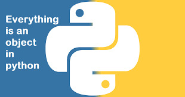

# Python, Everything is Object
  
## Description
This is my ***alx 10th Python project***, it's about the concept
of **"Everything is Object" in Python**.
> [!Note]
> In **.txt** files I will answer questions asked by in the project
> I can't share the questions becuase of the ***Copyright*** code.
## Technologies
* Python
